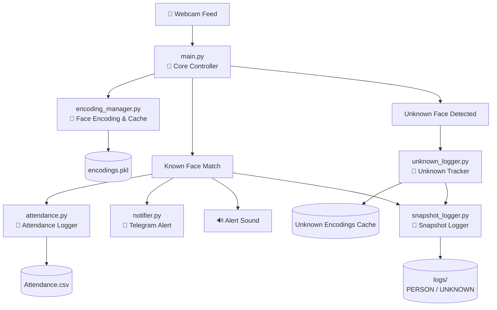

# Project-Argus
🎯 Real-Time Face Recognition Alert & Attendance System

A modular real-time face recognition system that:

✅ Detects known faces via webcam  
- Logs attendance with confidence and timestamp  
- Sends Telegram alerts when specific people are detected  
- Avoids duplicate logs using time threshold  
- Works offline with robust encoding & caching

✅ Detects unknown persons (not in your known face list).
- Ensures each unique unknown person is logged only once every X seconds.
- Logs include:
  - Name: "UNKNOWN"
  - Timestamp
  - Confidence score
  - Snapshot saved in logs/UNKNOWN/


---

## 📁 Project Structure
    Project-Argus/
    │
    ├── main.py
    ├── notifier.py
    ├── attendance.py
    ├── encoding_manager.py
    ├── logger/
    │   ├── snapshot_logger.py     # 🔍 NEW: Logs full frame + metadata on detection
    |   └── unknown_logger.py      # Tracks unknown face encodings and handles logging.
    │
    ├── ImagesAttendance/
    ├── encodings/
    ├── assets/
    │   ├── Attendance.csv
    │   └── alert.mp3
    ├── logs/                      # 📸 NEW: Auto-created snapshot + metadata storage
    │   ├── JASVANT/
    │   │    ├── last_seen.jpg         # full webcam frame at detection time
    │   │    └── meta.json             # info about detection
    │   └── UNKNOWN\
    │         ├── unknown_20250805_135039.jpg
    │         └── unknown_20250805_135051.jpg
    │
    ├── requirements.txt
    └── README.md

    
    venv/                          # prefer python 3.10

---

## 🚀 Features

- 🎥 **Real-Time Detection** using webcam
- 🧠 **Face Encoding Caching** for fast startup
- 📝 **Attendance Logging** to `assets/Attendance.csv`
- ⏱️ **Time Gap Protection**: Avoids repeating logs within 5 minutes per person
- 📈 **Confidence-Based Updates**: Higher-confidence detection updates older entry
- 📩 **Telegram Alert Notification** on specific names
- 🔊 **Alert Sound** when target person is detected
- 📸 Snapshot Logging: Saves full webcam frame + metadata when target person is detected
  - This helps in **post-review** or **evidence logging** of detected persons.


## 🧠 How It Works

✅ If Detects known faces via webcam 
1. Face images in `ImagesAttendance/` are encoded using `insightface`
2. Encodings are cached to `encodings/encodings.pkl`
3. `main.py` reads webcam frames and runs recognition
4. If person detected:
   - Logs entry in CSV (once per 5 minutes or if confidence is higher)
   - Sends Telegram alert if person is in your `TARGET_NAMES` list
   - Plays alert sound

✅ If Detects unknown persons (not in your known face list).
1. When a face doesn't match known encodings, its face encoding is compared to previously seen unknowns using a distance threshold.
2. If it's a new unknown person, it will be logged and snapshot will be saved.
3. If it's a known unknown, it will only be logged again after a gap of X seconds (configurable).
4. This prevents duplicate logging of the same person while allowing others to be logged immediately.

### 📸 Snapshot Logging on Detection

For every detection of a person in `TARGET_NAMES`, the system:

- Saves the **entire webcam frame** (not just the face)
- Stores the frame in: `logs/<PERSON_NAME>/last_seen.jpg`
- Saves metadata like:
  - `object_id` (internal ID)
  - `timestamp`
  - `bbox` (bounding box of the face inside frame)


### Work Flow Diagram


🗂 Example folder:

    logs/
    ├── JASVANT/
    │    ├── last_seen.jpg    # full webcam frame at detection time
    │    └── meta.json        # info about detection
    └── UNKNOWN\
         ├── unknown_20250805_135039.jpg
         └── unknown_20250805_135051.jpg

## 📸 Image Requirements

- Place clear, front-facing images in `ImagesAttendance/`
- Folder name must be the person's name (e.g., `JASVANT`) and file name must be like (`1.jpg , 2.jpg , 3.jpg etc`)
- Supported formats: `.jpg`, `.jpeg`, `.png`


## ⚙️ Configuration

### 🎯 Target Person(s) for Alert
Edit this in `main.py`:
```python
TARGET_NAMES = ["ELON MUSK", "JASVANT"]
```
## 📲 Telegram Alert Setup
```In notifier.py, replace:
BOT_TOKEN = "your_bot_token"
CHAT_ID = "your_chat_id"
```
- Use `BotFather` to create a bot and get a token
- Use `@userinfobot` to get your Chat ID


⏱️ Attendance Time Gap
```In attendance.py, change:
TIME_GAP_MINUTES = 5  # prevents frequent logging
```


## 🔊 Alert Sound
- Place your sound in assets/alert.mp3
- Must be in .mp3 format
- It will play when a target person is detected


## 📦 Installation
```🐍 1. Clone and Set Up Virtual Environment
git clone https://github.com/yourname/FaceRecognitionProject
cd FaceRecognitionProject
python -m venv venv
source venv/bin/activate  # or venv\Scripts\activate on Windows
```
```📦 2. Install Python Dependencies
pip install -r requirements.txt
```
If insightface or dlib fails:
- Use Python 3.10 or earlier for best compatibility


## ▶️ Running the Project
```
python main.py
```
- Press Q to exit the webcam
- Check attendance logs in assets/Attendance.csv


## 💡Tips
- Make sure lighting is good when capturing new face images
- Restart main.py after adding new images to generate encodings
- Add multiple names to TARGET_NAMES for multi-alerts
- Use .env file for storing secrets securely (optional)


## 🔐 Dependencies
```
insightface
opencv-python
numpy
pygame
requests
dlib (via insightface)
```
Install all with:
```
pip install -r requirements.txt
```
## 🔧 Environment Setup (Summary)
Project Argus relies on the `insightface` library, which has some setup requirements on Windows (especially for dlib).

To avoid common installation issues, follow this guide before running the project:

- Use Python 3.6–3.10
- Set up a virtual environment
- Install CMake and Visual Studio C++ Build Tools
- Install `dlib==19.24.2` and then `insightface`

📖 [Full Setup Guide Here](https://github.com/jasvant0020/face-recognition-windows-install-guid?tab=readme-ov-file#-face-recognition-setup-guide-windows)


## 📈 Example Attendance Entry
```
Name,Timestamp,Confidence
ELON MUSK,2025-08-02 16:40:09,91.34
JASVANT,2025-08-02 16:45:30,95.11
UNKNOWN,2025-08-02 16:50:01,85.02
ELON MUSK,2025-08-02 17:00:15,98.76
```


## 🛡️ License
This project is for educational and personal use. Commercial or surveillance use must comply with local laws regarding face recognition.


## 🙌 Credits
Developed by Jasvant
AI + Vision Enthusiast | Final-Year B.Tech
